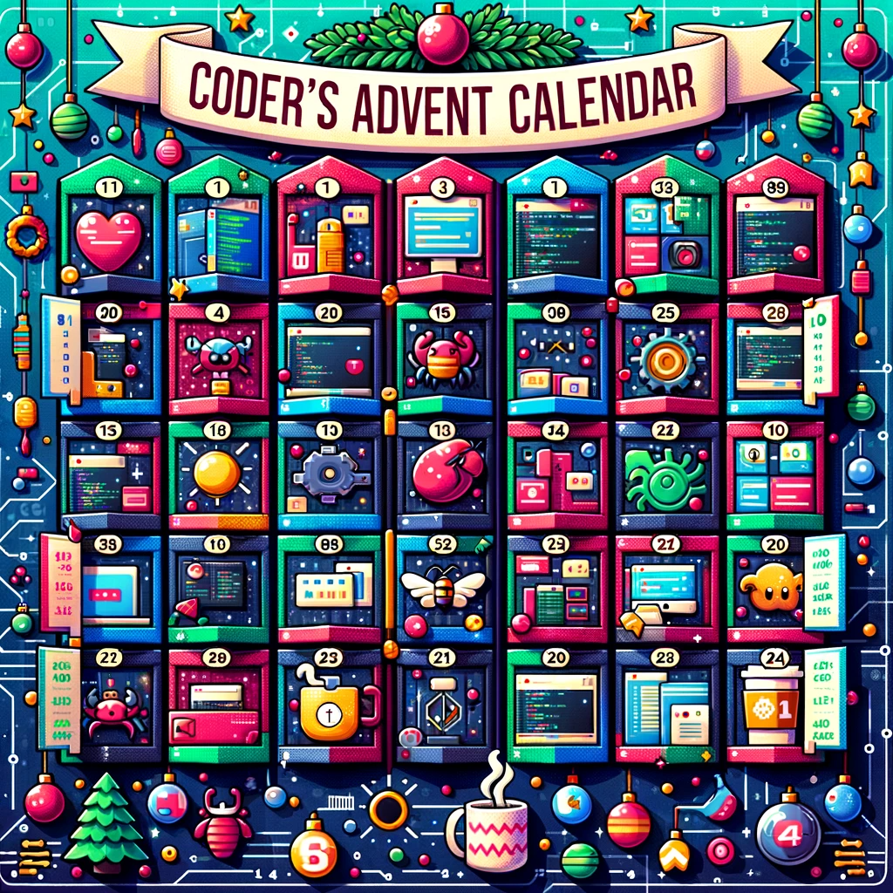

<h1 align="center" style="font-weight: bold;">Advent calendar? Yes, please but... orf code</h1>
<h3 align="center">Fun| CODE| Code skills</h3>

## Description

Advent Calendar of Code: Get into the Holiday Spirit with 24 Festive Coding Challenges

In this repository, you will discover 24 coding challenges related to Christmas, designed for programmers who are looking for some festive fun.
